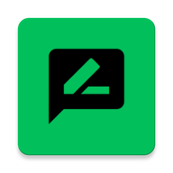
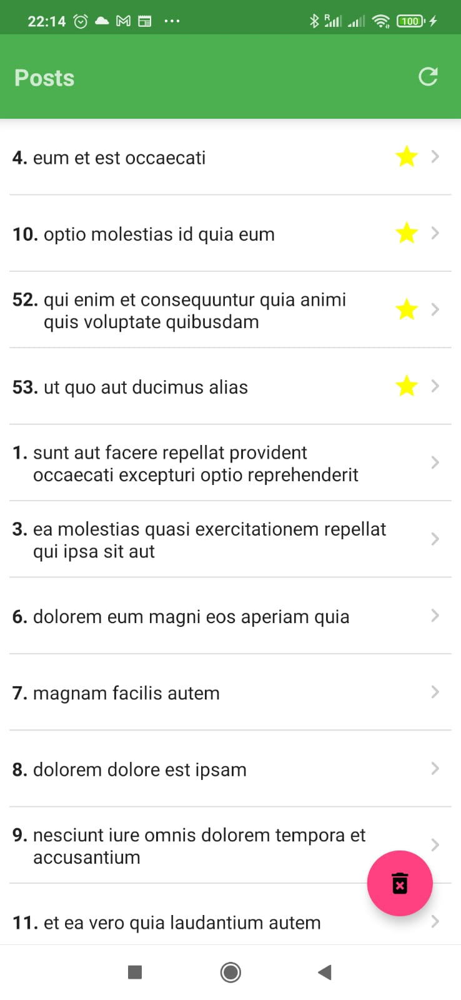
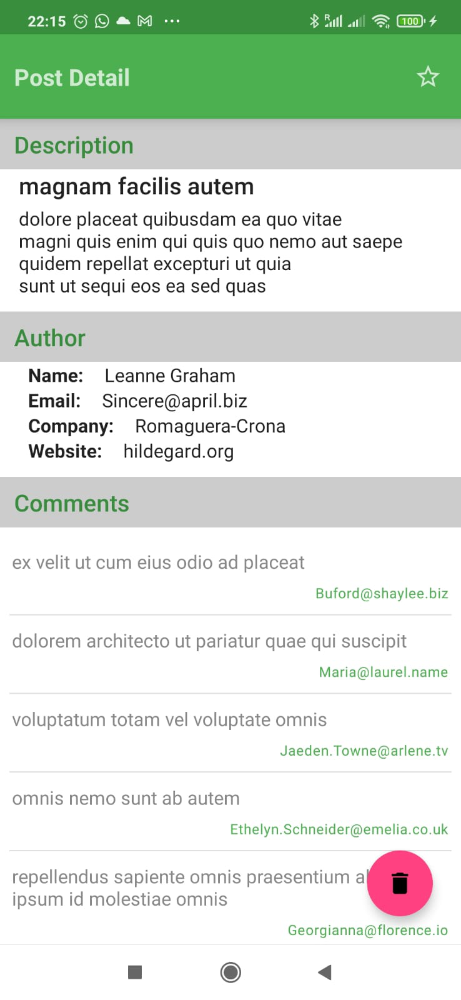

# PostsZemoga App 

                    
 
## App Funcionality

### Home Screen
- The home screen displays a list of post titles loaded from local storage(internal sqlite room database)
- If  no posts are found it automatically syncs them from https://jsonplaceholder.typicode.com/ on startup
- A refresh button allows to refresh posts from the API. Posts marked as favourite preserve their favourite status
- A delete all button allows to drop all posts not marked as favourite
### Detail Screen
- Displays details of individual post along with author data and comments that are loaded from the API on demand
- Buttons allow to mark the post as favourite or delete it from the list

## Clean architecture with 3 layers
- Data (for database and API code)
- Domain (for business logic (use cases) and models)
- Presentation (for UI logic, with MVVM)

## Tests
- Unit tests (only dummy tests beacuse most business logic sits in the Dao and would have required Implementation Tests)
    
## Other useful features
- UI made entirely using Jetpack Compose
- Dependency injection (with [Hilt](http://google.github.io/hilt/))
- Reactive programming with [Kotlin Flows](https://kotlinlang.org/docs/reference/coroutines/flow.html)
- Google [Material Design](https://material.io/blog/android-material-theme-color) library
- Room database for local caching
- Retrifit2 for network requests
- Android architecture components to share ViewModels during configuration changes
- Coroutines

# Getting started

### Script 
Download this repository extract and open it in Android Studio
And you're ready to install the app in Debug mode

# More
If you want to know more you can check our [blog post](https://www.bloco.io/blog/2020/android-app-starter-update).
